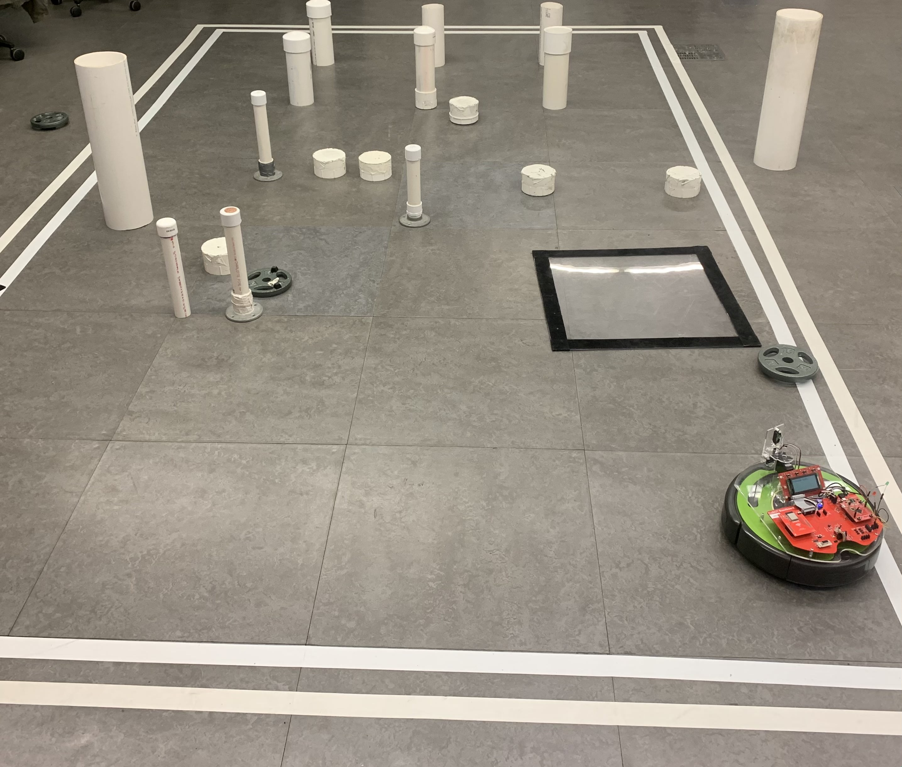
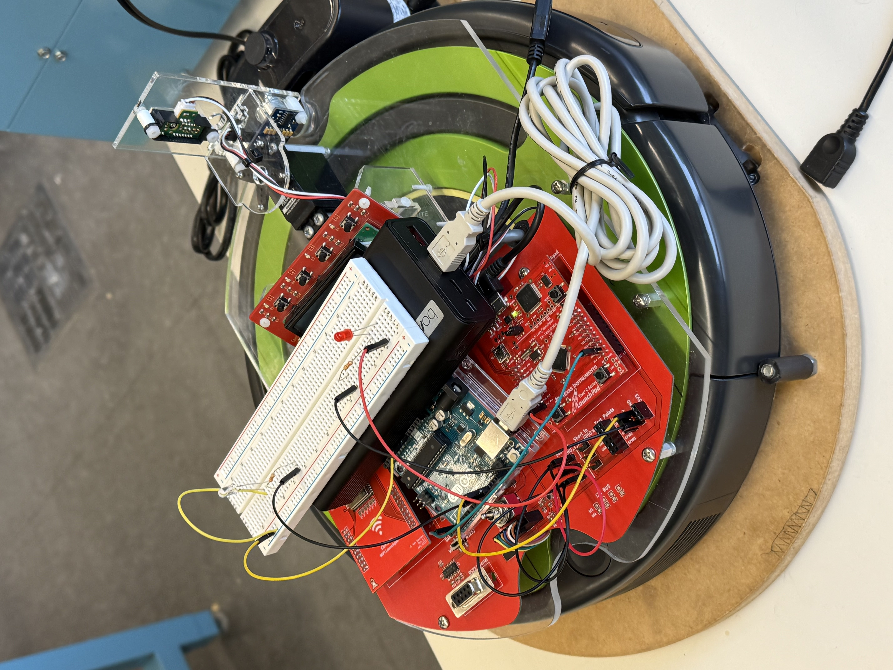
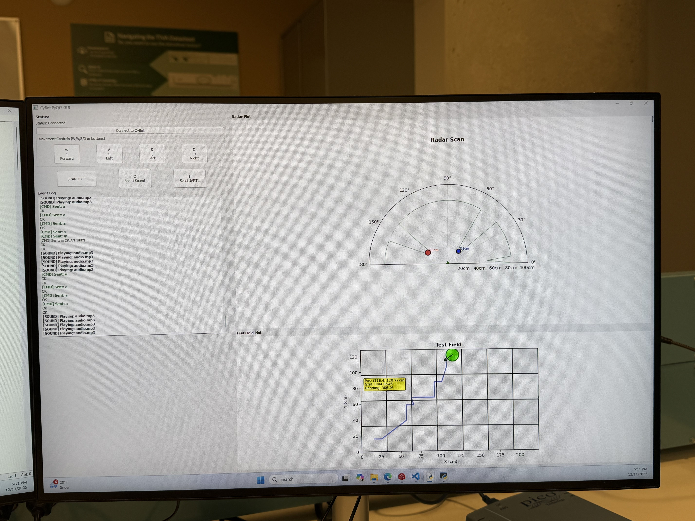

# 🤖 CyTank — Bluetooth Combat Robot System


A **full-stack autonomous combat robot system** — bare-metal C firmware on a Tiva C microcontroller, Arduino laser control via I2C, and a live Python PyQt5 GUI with radar visualization and Bluetooth control.

---

## 📸 Gallery

<div align="center">
  
  <p><em>CyTank navigating the combat field with obstacle targets</em></p>
</div>

<br/>

<table align="center">
  <tr>
    <td align="center" width="50%">
      
      <br/>
      <em>Hardware — Tiva C + Arduino + breadboard on iRobot base</em>
    </td>
    <td align="center" width="50%">
      
      <br/>
      <em>Live PyQt5 GUI — radar scan + test field position tracking</em>
    </td>
  </tr>
</table>

---

## 📋 Features

- 🎮 **Bluetooth Manual Control** — W/A/S/D keyboard + buttons in GUI send commands to robot wirelessly
- 🔭 **180° Radar Scanning** — press Scan in GUI → servo sweeps → live radar plot updates in real time
- 🔫 **Laser Firing System** — press Shoot in GUI → Tiva C sends I2C command → Arduino fires KY-008 laser
- 📡 **Live Radar Display** — detected objects shown with distance and angle on GUI radar plot
- 🗺️ **IMU Position Tracking** — robot's real-time position and heading shown on test field map in GUI
- ⚡ **Interrupt-Driven Firmware** — GPIO interrupts for fast, responsive sensor reading

---

## 🏗️ System Architecture

Here is exactly how the system works — from user input to robot action:

```
╔══════════════════════════════════════════════╗
║           Python PyQt5 GUI (Laptop)          ║
║                                              ║
║  User presses:                               ║
║  [W] Forward  [A] Left  [S] Back  [D] Right  ║
║  [Scan 180°]            [Shoot 🔫]           ║
╚══════════════════╦═══════════════════════════╝
                   ║
                   ║  Bluetooth (UART)
                   ║  GUI sends command string
                   ║  e.g. "w", "a", "shoot", "scan"
                   ▼
╔══════════════════════════════════════════════╗
║         Tiva C TM4C123G LaunchPad            ║
║                                              ║
║  Receives command via UART (Bluetooth)       ║
║                                              ║
║  IF move command (w/a/s/d):                  ║
║    → Sends drive command to iRobot via UART  ║
║                                              ║
║  IF scan command:                            ║
║    → Rotates servo motor (PWM)               ║
║    → Reads IR sensor at each angle           ║
║    → Sends distance + angle back to GUI      ║
║                                              ║
║  IF shoot command:                           ║
║    → Sends I2C signal to Arduino             ║
║                                              ║
║  ALWAYS: Reads IMU data                      ║
║    → Sends position + heading back to GUI    ║
╚══════╦═══════════════════════╦═══════════════╝
       ║                       ║
       ║ UART                  ║ I2C
       ▼                       ▼
╔══════════════╗     ╔══════════════════════╗
║ iRobot       ║     ║  Arduino Uno         ║
║ Create 2     ║     ║                      ║
║              ║     ║  Receives I2C signal ║
║ Moves robot: ║     ║  → Fires KY-008      ║
║ Forward      ║     ║    Laser Module 🔫   ║
║ Backward     ║     ╚══════════════════════╝
║ Turn Left    ║
║ Turn Right   ║
╚══════════════╝
```

### Data Flow Summary

| User Action | GUI Sends | Tiva C Does | Result |
|---|---|---|---|
| Press `W` | `"w"` over Bluetooth | UART → iRobot | Robot moves forward |
| Press `A` | `"a"` over Bluetooth | UART → iRobot | Robot turns left |
| Press `Scan` | `"scan"` over Bluetooth | Rotates servo + reads IR | Radar plot updates in GUI |
| Press `Shoot` | `"shoot"` over Bluetooth | I2C → Arduino | Laser fires |
| Always | — | Reads IMU | Position updates on GUI map |

---

## 🛠️ Built With

<p>
  
</p>

| Component | Technology |
|---|---|
| Firmware | C (Embedded C, Code Composer Studio) |
| Robot Base | iRobot Create 2 + CyBot Platform |
| Microcontroller | Tiva C Series TM4C123G LaunchPad |
| Laser Control | Arduino Uno + KY-008 Laser Module |
| GUI | Python PyQt5 |
| Wireless | Bluetooth Module (UART) |
| Sensing | IR Sensor, HC-SR04 Ultrasonic, IMU |
| Motion | Servo Motor (180° scan), DC Drive Motors |

---

## 📡 Communication Protocols

| Protocol | Between | Purpose |
|---|---|---|
| **UART (Bluetooth)** | GUI ↔ Tiva C | Send commands from GUI, receive sensor data back |
| **UART** | Tiva C ↔ iRobot base | Drive commands to move the robot |
| **I2C** | Tiva C → Arduino | Trigger laser fire command |
| **PWM** | Tiva C → Servo | Control servo angle for radar scanning |
| **GPIO + Interrupts** | Tiva C ← Sensors | Fast sensor reads and button inputs |

---

## 🚀 How to Run

### Hardware Required
- CyBot Platform (iRobot Create 2 base)
- Tiva C Series TM4C123G LaunchPad
- Arduino Uno + KY-008 Laser Module
- IR Sensor + HC-SR04 Ultrasonic Sensor
- Servo Motor + Bluetooth Module (HC-05)
- LCD Board

### Firmware (Tiva C)
```bash
# Open project in Code Composer Studio
# Build → Flash to TM4C123G LaunchPad
```

### Python GUI
```bash
# Install dependencies
pip install PyQt5 pyserial

# Run the GUI
python cytank_gui.py
```

---

## 💡 What I Learned

- **Bare-metal firmware** in C for ARM Cortex-M4 — no OS, direct hardware control
- **UART communication** — sending and receiving structured command strings wirelessly
- **I2C master/slave** — coordinating two microcontrollers (Tiva C + Arduino)
- **PWM generation** for precise servo motor angle control
- **Interrupt-driven programming** for fast, real-time sensor response
- **Python GUI** with PyQt5, serial communication, and live data visualization
- **Full system integration** — GUI + firmware + hardware all working together

---

## 👤 Author

**Jay Patel** — [@jppatel123](https://github.com/jppatel123)

[](https://linkedin.com/in/jayprakashbhai-patel)
[](mailto:jayppatel5078@gmail.com)

---

## 🏷️ Topics
`embedded-systems` `robotics` `c` `uart` `i2c` `pwm` `tiva-c` `arduino` `python` `pyqt5` `bluetooth` `arm-cortex-m4` `cpre288`